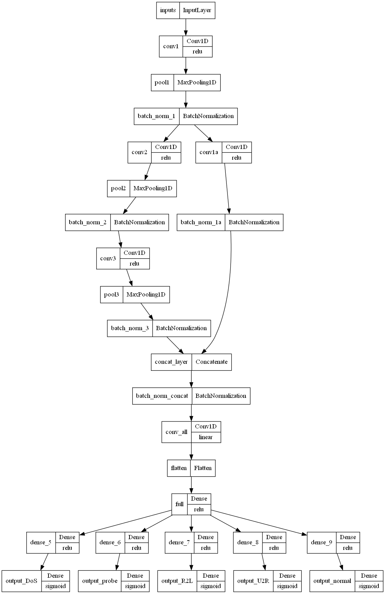
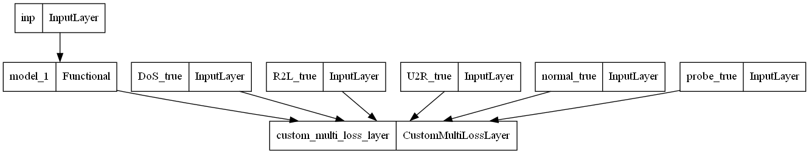

# Multi-task Learning-based Intrusion Detection
This is a Python code example of proposed model in paper **Intrusion Detection with Uncertainty based Loss Optimized Multi-Task Learning**.
The paper was submitted to the conference **[Conference on Info Processes and Sys Dev and QA](http://www.ieee.spb.ru/index.php?option=com_content&view=article&id=187:conf-on-inf-processes&catid=42:hot-news)**

- *mtl_intrusion_detection_keras.py* Main -file: Definition of the MTL model & implementation of custmized loss optimization layer.
- *mtlkeras_withcustomloss_example..ipynb* -Full example: MTL-based intrusion detection based on NSL-KDD datasets.

#### Visulization of MTL Model Structure

#### Visulization of Weight Optimization Layer

